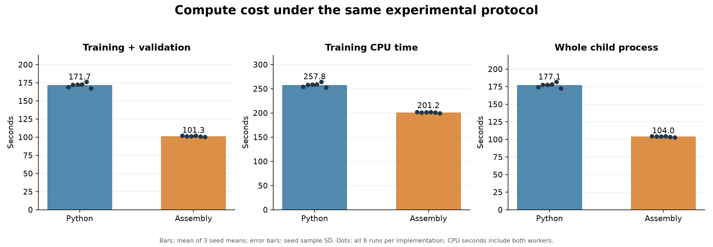
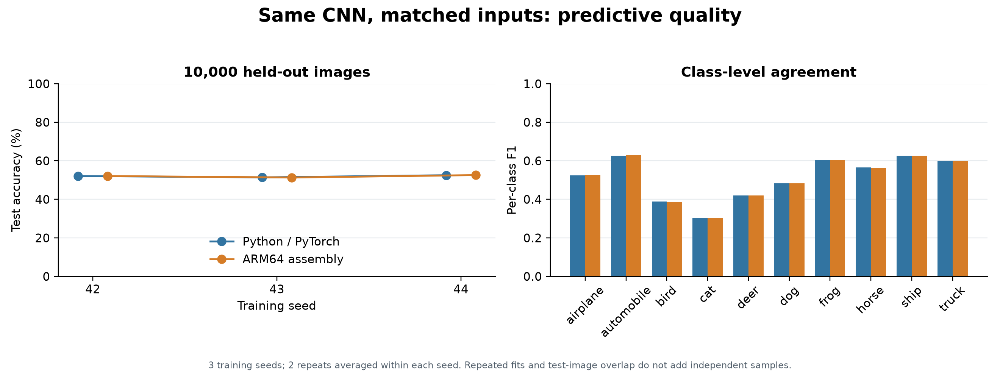
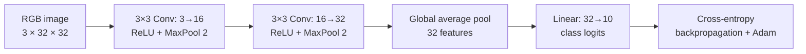
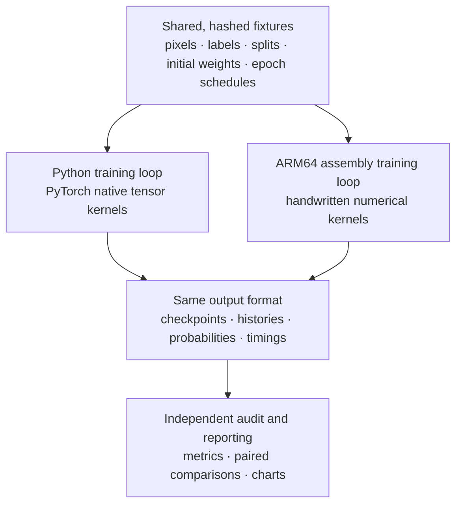
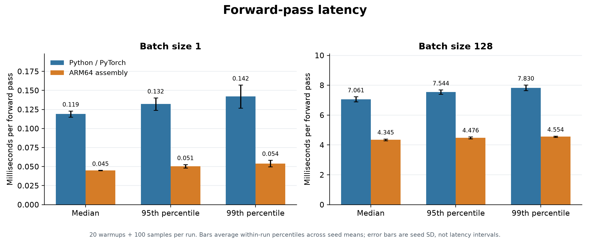
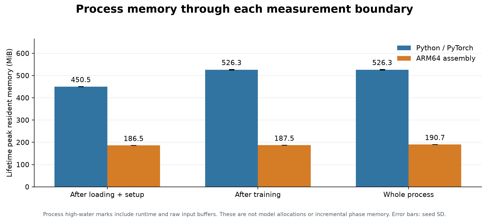
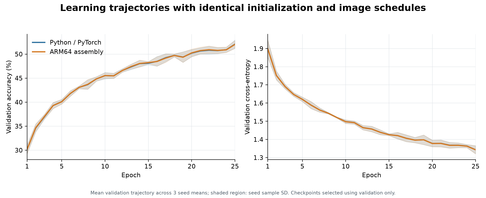

# CNN: Python vs. Assembly

[](https://github.com/logannye/cnn-python-vs-assembly/actions/workflows/test.yml)

**One tiny CNN, implemented twice: Python with PyTorch and handwritten ARM64 assembly.**
Both learn CIFAR-10 from the same initial weights, images, batch order and augmentation
choices. The experiment asks what changes in accuracy, training time, inference
latency and memory when the implementation changes.

The assembly version computes the convolutions, activations, pooling, loss,
gradients and Adam updates itself. Its executable calls macOS system routines
for files, memory, threads and clocks. Python prepares the shared fixtures and
audits assembly results; it does not train the assembly model.

## Measured comparison

Assembly completed the matched training loop **1.69× faster** (geometric mean of six paired ratios). Mean test accuracy was **51.99% for Python** and **51.99% for assembly**; the assembly-minus-Python mean difference was **-0.0033 percentage points**. This small observed difference does not establish statistical equivalence.

| Measurement | Python / PyTorch | ARM64 assembly |
|---|---:|---:|
| Test accuracy (%) | 51.99 ± 0.57 | 51.99 ± 0.63 |
| Test macro F1 | 0.5141 ± 0.0071 | 0.5140 ± 0.0075 |
| Training + validation (s) | 171.68 ± 1.02 | 101.34 ± 0.62 |
| Training CPU time (s) | 257.85 ± 1.65 | 201.18 ± 0.94 |
| Whole process (s) | 177.15 ± 1.01 | 104.01 ± 0.64 |
| Forward batch 1, median (ms) | 0.1190 ± 0.0040 | 0.0449 ± 0.0003 |
| Forward batch 128, median (ms) | 7.061 ± 0.169 | 4.345 ± 0.061 |
| Peak RSS through training (MiB) | 526.3 ± 1.4 | 187.5 ± 0.0 |

Values are mean ± sample SD across three seeds; timing repeats are averaged within seed. At about 52% test accuracy, this deliberately small network provides a modest, inspectable baseline.

Measured on **one Apple M4 Max MacBook Pro**, CPU float32, two compute threads,
25 epochs, three seeds and two repeats per seed per implementation: **12 complete
training runs**. Quality statistics use three seeds. Timing statistics average
the two repeats within each seed before summarizing the three seed means.





PyTorch's convolution and autograd operations execute compiled native kernels.
These numbers compare **these two implementations on this machine**; they do not
establish a general speed advantage of assembly over Python. Float32 reduction
orders differ, so the two implementations reproduce the same mathematical model
and training recipe without promising identical training trajectories.

## What is held constant?

| Control | Both implementations |
|---|---|
| Model | 3→16→32 convolutions, two ReLU/maxpool blocks, global average pool, 32→10 linear; **5,418 trainable parameters** |
| Images and splits | CIFAR-10, 32×32 RGB; 45,000 training / 5,000 validation / 10,000 test; identical original image IDs |
| Initialization | Identical float32 parameter files for seeds 42, 43 and 44 |
| Batch order and augmentation | Identical hashed 25-epoch image/flip streams; 50% horizontal-flip rule |
| Pixel arithmetic | Float32 `/255`, recorded flip, `−0.5`, `/0.5`; performed inside both training timers |
| Optimization | Cross-entropy; Adam lr 0.001, betas (0.9, 0.999), epsilon 1e-8; batch 128 including final partial batch |
| Training and selection | 25 epochs; highest validation accuracy, ties lower validation loss; test after selection |
| Compute budget | Same Mac CPU, float32, two compute threads, one training process at a time |
| Timed work | Epoch training + validation + best-checkpoint writes + epoch logging; setup and final evaluation excluded |
| Repeats | Two per seed, with implementation order reversed; all runs retained |

Kernel implementation, batching, memory layout, reduction order, dispatch and
runtime overhead are the intended differences. OS scheduling, background load
and physical temperature cannot be perfectly fixed. We use AC power, a fixed
15-second pause between processes and recorded power/thermal/load snapshots;
these controls reduce order effects without proving identical thermal conditions.

The [prespecified protocol](comparison/PROTOCOL.md) defines every timing boundary,
statistical summary and limitation. The [full report](experiments/baselines/cifar10-matched-cpu-25-v1/README.md)
links per-run metrics, paired predictions, raw observations and provenance.

## The same network in both implementations





## Inference, memory and learning



Inference uses identical pre-normalized test images, 20 warmups and 100 recorded
forward passes per batch size per run. Percentiles summarize individual runs;
the chart averages those percentiles across seed means. Transforms, softmax and
file I/O are outside this microbenchmark.



Memory is the process's lifetime peak RSS through each boundary, including
framework/runtime and loaded data. It is not just model memory, and subtracting
these peaks does not measure isolated phase allocations.



The report retains accuracy, top-k accuracy, cross-entropy, precision/recall/F1,
per-class results, confusion matrices, ROC/PR metrics, Brier score, calibration,
confidence, train/test gaps and uncertainty intervals. Every test prediction,
checkpoint and per-epoch measurement is retained for later experiments.

## Repository map

| Path | Responsibility |
|---|---|
| [`src/classifier/model.py`](src/classifier/model.py) | Small, readable PyTorch definition of the CNN |
| [`src/classifier/`](src/classifier/) | General image-folder training, evaluation, prediction and metrics |
| [`assembly/convolution.S`](assembly/convolution.S) | ARM64 convolution forward and backward kernels |
| [`assembly/model.S`](assembly/model.S) | Activations, pooling, linear layer, loss, gradients and Adam |
| [`assembly/runtime.S`](assembly/runtime.S) | Native input loading, two-worker training loop, selection, evaluation and timing |
| [`assembly/prepare.py`](assembly/prepare.py) | Export exact inputs, initial parameters and random-choice schedules |
| [`comparison/python_train.py`](comparison/python_train.py) | PyTorch loop consuming the same binary fixtures and output contract |
| [`comparison/run.py`](comparison/run.py) | Frozen run order, provenance gates, power snapshots and sequential child execution |
| [`comparison/validate.py`](comparison/validate.py) | Matched-input smoke, transform and numerical parity checks |
| [`comparison/report.py`](comparison/report.py) | Audit completed runs, calculate statistics and generate every comparison chart |
| [`experiments/baselines/`](experiments/baselines/) | Versioned reports and checksums; historical baselines remain intact |
| [`tests/`](tests/) | Python unit and workflow tests; native audits are documented separately |

The Python model can reuse autograd and configurable layers. The assembly
runtime makes every gradient, buffer layout and worker boundary explicit, and
is specialized to this network shape and the macOS ARM64 ABI. That difference
in implementation effort and portability is part of the comparison alongside
runtime performance.

Read the [assembly implementation guide](assembly/README.md),
[binary ABI](assembly/ABI.md), [native runtime contract](assembly/RUNTIME.md) and
[matched Python runtime contract](comparison/PYTHON_RUNTIME.md) to follow the
implementation details.

## Reproduce the comparison

The assembly executable targets **Apple silicon macOS** and requires Xcode
Command Line Tools. The ordinary Python classifier also works on other platforms.
Install Python 3.12 and use the recorded versions for the closest reproduction:

```bash
git clone https://github.com/logannye/cnn-python-vs-assembly.git
cd cnn-python-vs-assembly
python3.12 -m venv .venv
source .venv/bin/activate
python -m pip install -e '.[dev,benchmark]'
export PYTHONPATH=src
export OMP_NUM_THREADS=2 MKL_NUM_THREADS=2 PYTHONHASHSEED=0
```

See [the reproduction guide](comparison/REPRODUCE.md) for the exact package pins,
release downloads, input preparation, build, preflight checks, 12-run command
and chart regeneration. The retained binary fixtures remove dependence on
regenerating a particular framework's RNG stream. Rebuilt binaries may differ
because of compiler versions and build IDs; each new experiment records its
own hashes and gate evidence.

For a quick Python-only demonstration or your own image folders, follow the
[general classifier guide](docs/CLASSIFIER_GUIDE.md).

## Validation and retained evidence

The assembly math is checked against PyTorch for forward outputs, loss,
backpropagation, full gradients, Adam and a short training trajectory. A separate
standalone smoke exercises two epochs with a partial batch. Corrupt-input and
repeatability tests check the actual executable. The matched Python smoke also
checks preprocessing bitwise against the per-image reference.

For this release, **123 numerical parity checks plus 7 math-domain checks**, **22 native safety/repeatability checks**, **33 matched Python smoke checks** and **33 repository tests** passed. The post-run audit verified all **720,000 retained prediction rows**; all six within-implementation repeat pairs reproduced their numerical outputs exactly. An independent NumPy audit passed **563 checks**. See the [audit evidence](experiments/baselines/cifar10-matched-cpu-25-v1/independent-audit.json) and [summary](experiments/baselines/cifar10-matched-cpu-25-v1/summary.json).

Linux GitHub Actions checks Python lint, formatting, tests and the demo workflow.
The native assembly audits were run locally on the measured ARM64 Mac; the
Python CI badge does not stand in for those native checks.

The [matched experiment release](https://github.com/logannye/cnn-python-vs-assembly/releases/tag/comparison-cifar10-matched-cpu-25-v1)
contains full results, source snapshots, native executable, exact input fixtures
and SHA256 manifests. The committed report is a compact, readable mirror.

Earlier experiments remain available:

- [Original 10-epoch CPU baseline](experiments/baselines/cifar10-v1/README.md).
- [25-epoch Mac CPU DataLoader baseline](experiments/baselines/cifar10-mac-cpu-25-v1/README.md).
- [First 25-epoch assembly reproduction](experiments/baselines/cifar10-assembly-25-v1/README.md).

Those earlier timings use different data-loading/timing scopes. The matched
experiment above supersedes their Python/assembly speed ratio.
