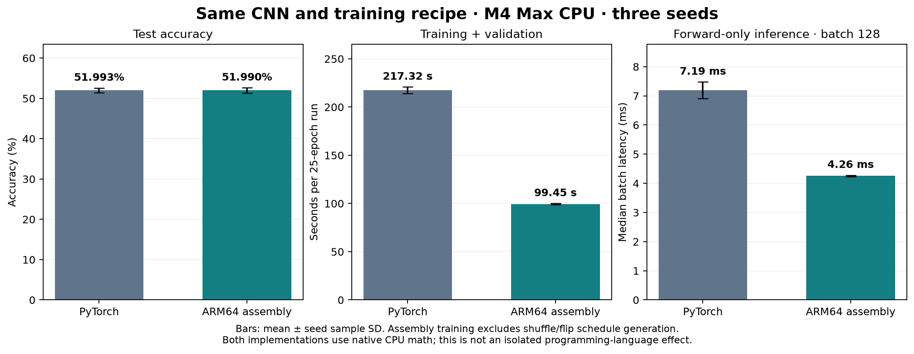

# Handwritten ARM64 CNN: 25-epoch comparison

Three seeds (42, 43, 44) completed the full CIFAR-10 protocol: 45,000 training, 5,000 validation and 10,000 test images; 25 epochs; batch 128; Adam; two CPU workers.

Assembly test accuracy is **51.99% ± 0.63 percentage points** (seed sample SD), compared with **51.99% ± 0.57** for the original PyTorch run. The mean difference is **-0.0033 percentage points**. Macro F1 is 0.5140 versus 0.5141.

| Seed | Assembly accuracy | PyTorch accuracy | Difference (pp) | Paired 95% interval (pp) | Prediction disagreement |
|---|---:|---:|---:|---|---:|
| 42 | 52.08% | 52.09% | -0.01 | [-0.11, +0.09] | 0.41% |
| 43 | 51.32% | 51.38% | -0.06 | [-0.15, +0.02] | 0.33% |
| 44 | 52.57% | 52.51% | +0.06 | [-0.14, +0.27] | 1.77% |

The paired intervals resample test images for each fixed model pair. They do not measure training-seed uncertainty and are not equivalence tests.

Mean training/validation/checkpoint time was 99.45 seconds for assembly and 217.32 seconds for PyTorch; assembly/PyTorch duration ratio = 0.458. Both ran on this Mac's CPU. PyTorch dispatches optimized native kernels; this is an implementation comparison, not a comparison against convolution implemented as interpreted Python loops. Assembly receives precomputed shuffle order and flip RNG decisions outside its training timer, whereas the baseline DataLoader performs that work inside its timer. Pixel normalization and applying the flips remain inside both training timers. The ratio therefore excludes assembly preparation and is not end-to-end time.

The replica reproduces the mathematical CNN and fixed training protocol. It does not promise bitwise-identical floating-point computations: different reductions can change the optimization trajectory over many updates. Exact initial weights, permutations, flip decisions and dataset memberships are retained. Kernel/gradient/optimizer parity is checked separately; saved final checkpoints are independently replayed on 128 real training images per seed using PyTorch inference only. All reported full-dataset metrics use probabilities produced by the assembly executable.

Timing scopes differ for final evaluation and CPU time; see comparison.json. Whole-process peak RSS includes different runtime overheads and excludes assembly's separate Python preparation/reporting process. Runs were sequential and can experience different thermal and background-load conditions.

- [Detailed metrics and learning curves](report.md)
- [Paired comparison and scope notes](comparison.json)
- [Independent audit](audit.json)
- [Source, protocol and environment](manifest.json)
- [File checksums](checksums.json)

Raw executable outputs are retained under each seed's raw/ directory. prepared/ retains initialization, schedules, labels and split indices; the 184 MB image tensor is referenced by hashes and reproducible from CIFAR-10, rather than duplicated. No test result selected the checkpoint or discarded a seed.

[Complete archive and mirror checksum scope](MIRROR.md).
