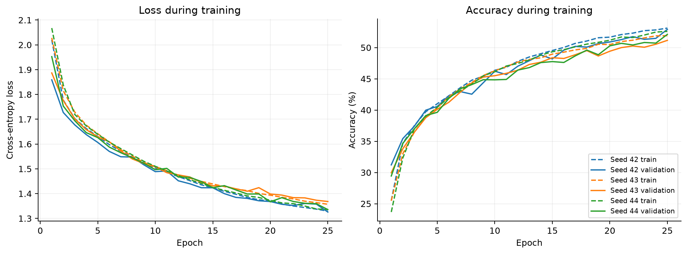

# CIFAR-10 Mac CPU baseline · 25 epochs

**Mean test accuracy: 51.99%**, with **0.57 percentage-point sample SD** across seeds 42, 43, and 44. The average error rate is 48.01%; uniform guessing is 10% accurate.

[Full quantitative report](report.md) · [Machine-readable comparison](comparison.json) · [Independent audit](audit.json) · [Complete evidence bundle](https://github.com/logannye/simple-cnn/releases/download/baseline-cifar10-mac-cpu-25-v1/cifar10-mac-cpu-25-v1.tar.gz) · [Release](https://github.com/logannye/simple-cnn/releases/tag/baseline-cifar10-mac-cpu-25-v1)

The unchanged 5,418-parameter CNN was trained from scratch for 25 epochs per seed on this Mac's CPU, using two Torch compute threads, one interop thread, and no data-loader workers. It uses the original 45,000 / 5,000 / 10,000 train / validation / test split, seeds, augmentation, batch size 128, and Adam learning rate 0.001. Each checkpoint is selected by validation accuracy, breaking ties by lower validation loss; test data never selects checkpoints or seeds.

## Test performance and prior reference

Values are mean ± sample SD across three seeds. Percentage-metric SD is in percentage points (pp). These are descriptive seed summaries, not confidence intervals for the mean.

| Metric | Hosted CPU, 10 epochs | Mac CPU, 25 epochs |
|---|---:|---:|
| Top-1 accuracy | 46.36% ± 0.26 pp | 51.99% ± 0.57 pp |
| Macro F1 | 0.4551 ± 0.0031 | 0.5141 ± 0.0071 |
| Top-3 accuracy | 79.39% ± 0.16 pp | 83.39% ± 0.80 pp |
| Top-5 accuracy | 91.70% ± 0.16 pp | 93.84% ± 0.45 pp |
| Negative log likelihood | 1.4978 ± 0.0032 | 1.3443 ± 0.0222 |
| Multiclass Brier score | 0.6776 ± 0.0013 | 0.6185 ± 0.0082 |
| Expected calibration error (15 bins) | 4.89% ± 0.72 pp | 3.25% ± 0.38 pp |
| Macro one-vs-rest ROC AUC | 0.8694 ± 0.0011 | 0.8946 ± 0.0027 |
| Macro average precision | 0.4772 ± 0.0026 | 0.5493 ± 0.0103 |

The test accuracy difference is **+5.63 pp** versus the [original reference](https://github.com/logannye/simple-cnn/blob/main/experiments/baselines/cifar10-v1/report.md). Both the training budget and computing platform changed. This comparison cannot attribute the difference solely to added epochs or isolate a hardware speedup; deterministic settings do not guarantee identical trajectories across CPU architectures/native kernels.

## Individual runs and fit

| Seed | Selected epoch | Train accuracy | Validation accuracy | Test accuracy | Test accuracy 95% CI | Macro F1 | Macro F1 95% CI |
|---|---:|---:|---:|---:|---|---:|---|
| 42 | 25 | 53.58% | 52.92% | 52.09% | [51.11%, 53.07%] | 0.5185 | [0.5088, 0.5281] |
| 43 | 25 | 52.10% | 51.16% | 51.38% | [50.40%, 52.36%] | 0.5059 | [0.4958, 0.5156] |
| 44 | 25 | 53.25% | 52.12% | 52.51% | [51.53%, 53.49%] | 0.5179 | [0.5080, 0.5274] |

The mean train-minus-validation accuracy gap is 0.91 pp (range 0.66–1.13 pp), using deterministic evaluation of each selected checkpoint. Learning curves report augmented minibatches with changing weights, so their training values differ. The achieved fit and held-out error characterize this fixed budget; they do not establish convergence, optimal hyperparameters, robustness, or the architecture's maximum performance.

The 95% intervals are Wilson accuracy intervals and 1,000-resample bootstrap macro-F1 intervals for individual fitted models. They rely on representative iid examples, exclude training-seed variability, and reuse the same 10,000 test images across runs.

## Learning beyond epoch 10 on this Mac

| Seed | Best epoch through 10 | Best validation accuracy through 10 | Best epoch through 25 | Best validation accuracy through 25 | Gain |
|---|---:|---:|---:|---:|---:|
| 42 | 10 | 46.22% | 25 | 52.92% | +6.70 pp |
| 43 | 10 | 45.50% | 25 | 51.16% | +5.66 pp |
| 44 | 9 | 44.86% | 25 | 52.12% | +7.26 pp |

Mean gain is 6.54 pp (sample SD 0.81 pp). This comparison uses the same Mac trajectories, so it avoids the old-host confound. It is a descriptive validation result: choosing among more checkpoints can raise the selected validation maximum. The epoch-10 checkpoints were not tested again, and no additional test-based selection was performed.

## Class-level strengths and weaknesses

Across seeds, the highest mean class F1 scores are automobile (62.75% F1), ship (62.56% F1); the lowest are cat (30.40% F1), bird (38.78% F1). For representative seed 42, the largest directed error is dog → cat: 243 of 1,000 images (24.3%). The report and comparison JSON retain all class precision, recall, F1, AUC, average precision, confusion counts, and confidence/calibration results.

## Runtime and resources

| Measurement | Mac CPU mean ± sample SD |
|---|---:|
| Training + validation wall time per seed | 217.3 ± 3.5 s |
| Training + validation wall time per epoch | 8.69 ± 0.14 s |
| Training loop throughput | 5454.1 ± 89.3 images/s |
| Final evaluation wall time | 5.6 ± 0.3 s |
| Warm batch-1 forward median latency | 0.1125 ± 0.0035 ms |
| Warm batch-128 forward median latency | 7.1887 ± 0.2868 ms |
| Whole-process peak RSS | 890.1 ± 1.7 MiB |

These are two-thread CPU measurements, not full-machine capacity or GPU results. Training wall time includes validation and checkpoint writes and excludes dependency setup/download. Inference uses 20 warmup and 100 measured forward passes on preprocessed tensors; it excludes I/O, transforms, model loading, and softmax. P95 latency, individual samples, CPU time, per-epoch timing, and per-split prediction time are retained. RSS is the process lifetime high-water mark including the dataset and metric computations. Background load, power, and thermal conditions can affect local timing.

## Retained evidence and next comparisons

- Trained source revision: `ec931522316e4c0af783da9425a5797422d4f301`; release tag: `baseline-cifar10-mac-cpu-25-v1`. The manifest records computation provenance, which precedes any later commit storing these results.
- [Manifest](manifest.json), [summary](summary.json), [full report](report.md), [comparison](comparison.json), [audit](audit.json), and [bundle checksums](checksums.json). The bundle retains all collected environment/hardware records, package freezes, Torch build configuration, source records, and logs.
- All three selected checkpoints; exact split indices; 180,000 indexed probability rows across three seeds and three splits; histories; metrics; timing samples; and figures. There are 10,000 unique test examples.
- The independent audit passed, checking 42 pre-assessment artifact hashes and 180,000 prediction rows, plus the checks listed in audit.json. checksums.json is regenerated after adding this assessment, comparison, and audit; its final file count can therefore differ from the audit's earlier count.
- Download the [complete archive](https://github.com/logannye/simple-cnn/releases/download/baseline-cifar10-mac-cpu-25-v1/cifar10-mac-cpu-25-v1.tar.gz) for checkpoints and predictions. The repository mirrors reports, JSON, figures, and text; binary model/prediction files remain in the release asset.
- For the next hardware comparison, preserve these 25 epochs, splits, seeds, batch size, preprocessing, evaluation, and precision, recording any changes. Compare indexed predictions with paired methods, retain seed variability, and use validation data for experimental choices. Repeated selection based on this test set would make it development data.
