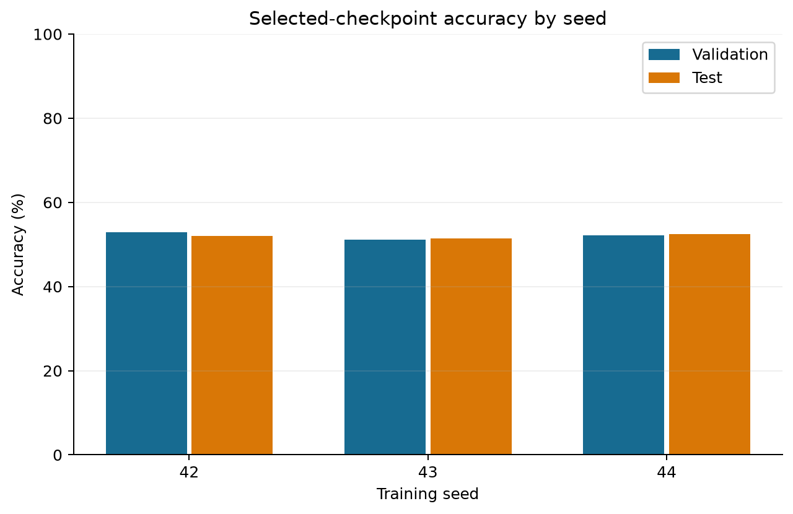
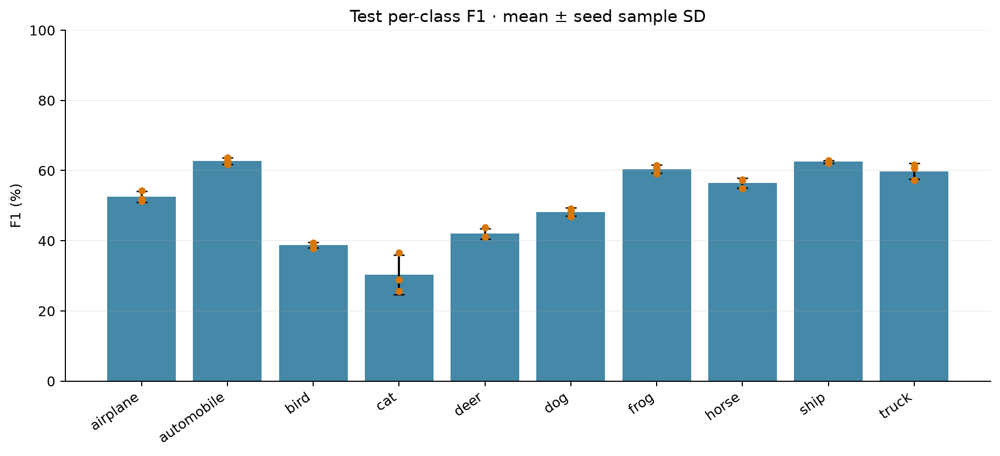
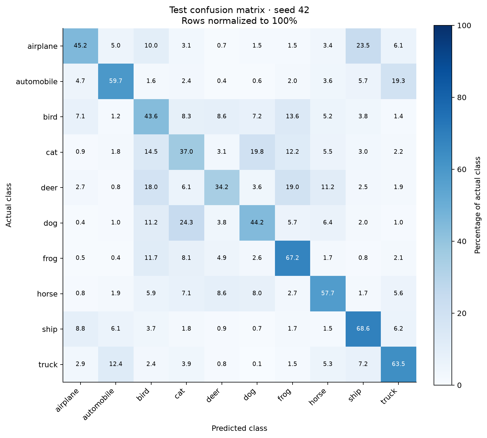
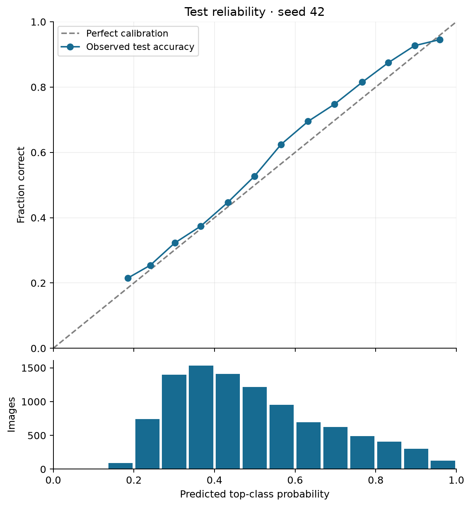

> Repository mirror: [complete evidence bundle](https://github.com/logannye/simple-cnn/releases/download/baseline-cifar10-mac-cpu-25-v1/cifar10-mac-cpu-25-v1.tar.gz). Checkpoint and prediction links below download the full archive; extract it and use the corresponding paths under `cifar10-mac-cpu-25-v1/`.

# Simple CNN · CIFAR-10 baseline

This report contains **3 completed training seeds**: 42, 43, 44. Detailed example-level diagnostics use representative seed **42** (seed 42 when available; otherwise the lowest completed seed).

## Evaluation protocol

The CNN is trained from randomly initialized weights, with no pretraining. The official CIFAR-10 training set is split into training and validation subsets; the official test set remains separate. The same saved split is used across training seeds. Within each seed, the checkpoint is selected by highest validation accuracy, breaking ties by lower validation loss. Test results do not select checkpoints or seeds.

Final train, validation, and test metrics below evaluate the selected checkpoint with evaluation preprocessing. Epoch training metrics use augmented images and mix successive model states, so they need not equal final training metrics.

| Split | Images (representative seed) |
|---|---:|
| Train | 45,000 |
| Validation | 5,000 |
| Test | 10,000 |

Uniform random top-1 guessing has expected accuracy **10%** for this 10-class benchmark. This is a reference point, not a trained competing model.

## Test performance across seeds

Every seed uses the same test images. Means and sample standard deviations describe variation across training seeds; repeated test predictions are not independent test sets. Standard deviations of percentage metrics are shown in percentage points. A small number of seeds provides only a preliminary estimate of training variability.

| Metric | Mean | Sample SD | Minimum | Maximum |
|---|---:|---:|---:|---:|
| Top-1 accuracy | 51.99% | 0.57% | 51.38% | 52.51% |
| Balanced accuracy | 51.99% | 0.57% | 51.38% | 52.51% |
| Macro precision | 52.01% | 0.69% | 51.28% | 52.64% |
| Macro recall | 51.99% | 0.57% | 51.38% | 52.51% |
| Macro F1 | 51.41% | 0.71% | 50.59% | 51.85% |
| Weighted F1 | 51.41% | 0.71% | 50.59% | 51.85% |
| Top-3 accuracy | 83.39% | 0.80% | 82.47% | 83.91% |
| Top-5 accuracy | 93.84% | 0.45% | 93.33% | 94.15% |
| Negative log likelihood | 1.3443 | 0.0222 | 1.3281 | 1.3695 |
| Multiclass Brier score | 0.6185 | 0.0082 | 0.6123 | 0.6278 |
| Expected calibration error | 3.25% | 0.38% | 2.92% | 3.66% |
| Maximum calibration error | 5.98% | 0.64% | 5.25% | 6.42% |
| Mean confidence | 48.83% | 0.45% | 48.33% | 49.21% |
| Confidence when correct | 55.59% | 0.67% | 54.89% | 56.24% |
| Confidence when incorrect | 41.51% | 0.10% | 41.39% | 41.57% |
| Macro one-vs-rest ROC AUC | 0.8946 | 0.0027 | 0.8915 | 0.8968 |
| Macro average precision | 0.5493 | 0.0103 | 0.5386 | 0.5593 |

Lower negative log likelihood, Brier score, ECE, and MCE are better. Brier score sums squared probability error over classes, then averages over images. ECE is the count-weighted absolute accuracy–confidence gap over 15 equal-width bins; MCE is the largest nonempty-bin gap. Both depend on the binning. ROC AUC and average precision use one-vs-rest scores averaged equally over classes. Undefined metrics appear as —.

## Individual runs and uncertainty

| Seed | Selected epoch | Validation accuracy | Test accuracy | Accuracy 95% CI | Macro F1 | Macro F1 95% CI |
|---|---:|---:|---:|---|---:|---|
| 42 | 25 | 52.92% | 52.09% | [51.11%, 53.07%] | 51.85% | [50.88%, 52.81%] |
| 43 | 25 | 51.16% | 51.38% | [50.40%, 52.36%] | 50.59% | [49.58%, 51.56%] |
| 44 | 25 | 52.12% | 52.51% | [51.53%, 53.49%] | 51.79% | [50.80%, 52.74%] |

Accuracy intervals use the 95% Wilson method. Macro F1 intervals use a percentile bootstrap over test examples (1000 resamples; the random seed and exact method are saved in each metrics.json). These intervals describe test-sample uncertainty conditional on a fitted model and an independent, representative sampling assumption; they do not include training-seed variability or distribution shift. They are not intervals for the cross-seed mean.

## Fit and learning curves

| Seed | Final train accuracy | Validation accuracy | Test accuracy | Train − validation gap |
|---|---:|---:|---:|---:|
| 42 | 53.58% | 52.92% | 52.09% | 0.66 pp |
| 43 | 52.10% | 51.16% | 51.38% | 0.94 pp |
| 44 | 53.25% | 52.12% | 52.51% | 1.13 pp |




## Class-level performance

The table reports seed 42; the figure summarizes all completed seeds.

| Class | Support | Precision | Recall | F1 | ROC AUC | Average precision |
|---|---:|---:|---:|---:|---:|---:|
| airplane | 1000 | 61.08% | 45.20% | 51.95% | 0.9080 | 0.5974 |
| automobile | 1000 | 66.11% | 59.70% | 62.74% | 0.9467 | 0.6963 |
| bird | 1000 | 35.56% | 43.60% | 39.17% | 0.8198 | 0.3769 |
| cat | 1000 | 36.24% | 37.00% | 36.62% | 0.8446 | 0.3487 |
| deer | 1000 | 51.82% | 34.20% | 41.20% | 0.8669 | 0.4653 |
| dog | 1000 | 50.06% | 44.20% | 46.95% | 0.8904 | 0.5054 |
| frog | 1000 | 52.87% | 67.20% | 59.18% | 0.9197 | 0.6402 |
| horse | 1000 | 56.85% | 57.70% | 57.27% | 0.9036 | 0.6202 |
| ship | 1000 | 57.74% | 68.60% | 62.71% | 0.9354 | 0.6860 |
| truck | 1000 | 58.10% | 63.50% | 60.68% | 0.9329 | 0.6562 |





Most frequent directed errors for seed 42:

| Actual → predicted | Images | Percentage of actual class |
|---|---:|---:|
| dog → cat | 243 | 24.30% |
| airplane → ship | 235 | 23.50% |
| cat → dog | 198 | 19.80% |
| automobile → truck | 193 | 19.30% |
| deer → frog | 190 | 19.00% |
| deer → bird | 180 | 18.00% |
| cat → bird | 145 | 14.50% |
| bird → frog | 136 | 13.60% |
| truck → automobile | 124 | 12.40% |
| cat → frog | 122 | 12.20% |

## Confidence and calibration

For seed 42, mean top-class confidence is 49.21%. It is 56.24% on correct predictions and 41.56% on incorrect predictions. Confidence is a model probability, not a guarantee of correctness. The reliability plot shows observed accuracy against mean confidence in each nonempty bin; the lower panel shows how many images fall in each bin. No post-hoc calibration is fitted.



## Runtime and resource use

| Seed | Train (s) | Final evaluation (s) | Parameters | Checkpoint (MiB) | Peak process RSS (MiB) |
|---|---:|---:|---:|---:|---:|
| 42 | 213.6231 | 5.4521 | 5418 | 0.0243 | 888.5469 |
| 43 | 217.8326 | 5.9712 | 5418 | 0.0243 | 889.9219 |
| 44 | 220.5159 | 5.4593 | 5418 | 0.0243 | 891.9375 |

| Seed | Batch size | Median batch latency (ms) | P95 batch latency (ms) | Images/s |
|---|---:|---:|---:|---:|
| 42 | 1 | 0.1155 | 0.1318 | 8683.7260 |
| 42 | 128 | 7.1399 | 7.4183 | 17890.5213 |
| 43 | 1 | 0.1087 | 0.1359 | 8881.0589 |
| 43 | 128 | 7.4968 | 7.8206 | 17055.6958 |
| 44 | 1 | 0.1134 | 0.1244 | 8932.3303 |
| 44 | 128 | 6.9294 | 7.0814 | 18459.0393 |

Timing is specific to the recorded host, device, thread count, batch size, warmup, and measurement procedure. Hosted runners can differ between seeds; consult each seed's environment in manifest.json before comparing speed. Latency measurements cover the model forward pass described in performance.json, not an end-to-end image-serving pipeline. Peak RSS is the process high-water mark, including data and evaluation allocations; it is not an isolated model-memory measurement. Per-epoch training and validation timings are retained in history.json.

## Retained evidence and future comparisons

- [Machine-readable summary](summary.json): per-seed scalar values and cross-seed aggregates.
- [Manifest](manifest.json): source revision, protocol, configuration, package versions, and hardware/software environment.
- [Split indices](https://github.com/logannye/simple-cnn/releases/download/baseline-cifar10-mac-cpu-25-v1/cifar10-mac-cpu-25-v1.tar.gz): exact training and validation memberships.
- Seed 42: [metrics](seed-42/metrics.json), [history](seed-42/history.json), [performance](seed-42/performance.json), [checkpoint](https://github.com/logannye/simple-cnn/releases/download/baseline-cifar10-mac-cpu-25-v1/cifar10-mac-cpu-25-v1.tar.gz), [train predictions](https://github.com/logannye/simple-cnn/releases/download/baseline-cifar10-mac-cpu-25-v1/cifar10-mac-cpu-25-v1.tar.gz), [validation predictions](https://github.com/logannye/simple-cnn/releases/download/baseline-cifar10-mac-cpu-25-v1/cifar10-mac-cpu-25-v1.tar.gz), [test predictions](https://github.com/logannye/simple-cnn/releases/download/baseline-cifar10-mac-cpu-25-v1/cifar10-mac-cpu-25-v1.tar.gz).
- Seed 43: [metrics](seed-43/metrics.json), [history](seed-43/history.json), [performance](seed-43/performance.json), [checkpoint](https://github.com/logannye/simple-cnn/releases/download/baseline-cifar10-mac-cpu-25-v1/cifar10-mac-cpu-25-v1.tar.gz), [train predictions](https://github.com/logannye/simple-cnn/releases/download/baseline-cifar10-mac-cpu-25-v1/cifar10-mac-cpu-25-v1.tar.gz), [validation predictions](https://github.com/logannye/simple-cnn/releases/download/baseline-cifar10-mac-cpu-25-v1/cifar10-mac-cpu-25-v1.tar.gz), [test predictions](https://github.com/logannye/simple-cnn/releases/download/baseline-cifar10-mac-cpu-25-v1/cifar10-mac-cpu-25-v1.tar.gz).
- Seed 44: [metrics](seed-44/metrics.json), [history](seed-44/history.json), [performance](seed-44/performance.json), [checkpoint](https://github.com/logannye/simple-cnn/releases/download/baseline-cifar10-mac-cpu-25-v1/cifar10-mac-cpu-25-v1.tar.gz), [train predictions](https://github.com/logannye/simple-cnn/releases/download/baseline-cifar10-mac-cpu-25-v1/cifar10-mac-cpu-25-v1.tar.gz), [validation predictions](https://github.com/logannye/simple-cnn/releases/download/baseline-cifar10-mac-cpu-25-v1/cifar10-mac-cpu-25-v1.tar.gz), [test predictions](https://github.com/logannye/simple-cnn/releases/download/baseline-cifar10-mac-cpu-25-v1/cifar10-mac-cpu-25-v1.tar.gz).

Prediction archives retain labels, class probabilities, and example indices. A future model can use these same splits, seeds, evaluation code, and indexed test examples for paired comparisons. Fix the next experiment's protocol before examining its test results, select checkpoints using validation only, and report both paired test-example uncertainty and variability across training seeds. Repeated experiment selection based on this test set will turn it into development data.

This is a small CNN baseline at a fixed 25-epoch training budget, not an estimate of the architecture's maximum attainable accuracy. It does not establish optimal hyperparameters, convergence, state-of-the-art performance, robustness to distribution shift, or production suitability.

## Recorded protocol

```json
{
  "accuracy_interval": "95% Wilson; one fitted model, iid test examples",
  "augmentation": "RandomHorizontalFlip(p=0.5) training only",
  "batch_size": 128,
  "betas": [
    0.9,
    0.999
  ],
  "checkpoint_selection": "highest validation accuracy; ties use lower validation loss",
  "class_names": [
    "airplane",
    "automobile",
    "bird",
    "cat",
    "deer",
    "dog",
    "frog",
    "horse",
    "ship",
    "truck"
  ],
  "dataset": "CIFAR-10",
  "dataset_citation": "Alex Krizhevsky, Learning Multiple Layers of Features from Tiny Images, 2009",
  "dataset_source": "https://www.cs.toronto.edu/~kriz/cifar.html",
  "deterministic_algorithms": true,
  "ece_bins": 15,
  "epochs": 25,
  "epsilon": 1e-08,
  "final_train_scope": "Deterministic unaugmented training split at selected checkpoint",
  "image_size": 32,
  "initialization": "PyTorch default, from scratch; no pretrained weights",
  "learning_rate": 0.001,
  "macro_f1_interval": "95% bootstrap; 1000 multinomial draws from confusion counts",
  "majority_class_accuracy": 0.1,
  "normalization_mean": [
    0.5,
    0.5,
    0.5
  ],
  "normalization_std": [
    0.5,
    0.5,
    0.5
  ],
  "optimizer": "Adam",
  "random_uniform_accuracy": 0.1,
  "scheduler": null,
  "seeds": [
    42,
    43,
    44
  ],
  "split_seed": 1729,
  "test_examples": 10000,
  "test_policy": "Evaluate once after all epochs and checkpoint selection for each seed",
  "train_examples": 45000,
  "training_curve_scope": "Augmented pre-update minibatch metrics; changing weights",
  "uniform_brier_score": 0.9,
  "uniform_nll": 2.302585092994046,
  "validation_examples": 5000,
  "weight_decay": 0
}
```

## Source provenance

```json
{
  "command": [
    "/Users/logannye/Documents/Codex/2026-10-02/what/outputs/simple-cnn/src/classifier/benchmark.py",
    "--data-dir",
    "data/cifar10",
    "--output",
    "results/mac-cpu-25-seed-runs/baseline-seed-42",
    "--seeds",
    "42",
    "--split-seed",
    "1729",
    "--epochs",
    "25",
    "--batch-size",
    "128",
    "--learning-rate",
    "0.001",
    "--threads",
    "2"
  ],
  "git_revision": "ec931522316e4c0af783da9425a5797422d4f301",
  "github_run_url": null,
  "model_source_sha256": "12f4bb6d92783000e89625408ac2a734892c8eeabe1b4d199aff09c39e77a0b2",
  "working_tree_clean": true
}
```
